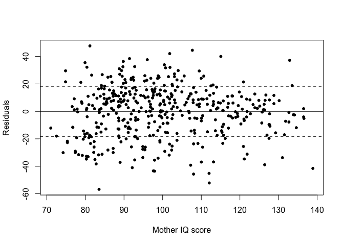
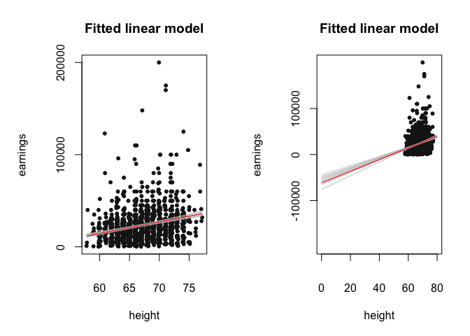
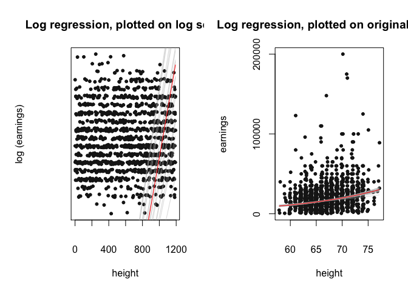

MLM: Lab 1, Review of Linear and Generalized Linear Modeling
================
Constanza F. Schibber
1/20/2021

- [1 Installing & Loading Packages](#1-installing--loading-packages)
- [2 Chapter 2: Concepts and methods from basic probability and
  statistics](#2-chapter-2-concepts-and-methods-from-basic-probability-and-statistics)
  - [2.1 Section 2.3](#21-section-23)
- [3 Chapter 3: Linear Regression. The
  basics.](#3-chapter-3-linear-regression-the-basics)
  - [3.1 3.1 One predictor](#31-31-one-predictor)
  - [3.2 3.2 Multiple predictors](#32-32-multiple-predictors)
  - [3.3 3.3 Interactions](#33-33-interactions)
  - [3.4 3.5 Graphical displays of data and fitted
    model](#34-35-graphical-displays-of-data-and-fitted-model)
  - [3.5 3.6 Assumptions and
    diagnostics](#35-36-assumptions-and-diagnostics)
  - [3.6 3.7 Prediction and
    validation](#36-37-prediction-and-validation)
  - [3.7 Exercise 3.4 – Practice!](#37-exercise-34--practice)
- [4 Chapter 4: Linear regression: before and after fitting the
  model](#4-chapter-4-linear-regression-before-and-after-fitting-the-model)
  - [4.1 4.1 Linear transformations](#41-41-linear-transformations)
  - [4.2 4.2 Centering and standardizing, especially for models with
    interactions](#42-42-centering-and-standardizing-especially-for-models-with-interactions)
  - [4.3 4.4 Logarithmic
    transformations](#43-44-logarithmic-transformations)
  - [4.4 Exercise 4.4 – Practice!](#44-exercise-44--practice)
  - [4.5 4.5 Other transformations](#45-45-other-transformations)
- [5 Chapter 5: Logistic Regression](#5-chapter-5-logistic-regression)
  - [5.1 5.4 Building a logistic regression model: Wells in
    Bangladesh](#51-54-building-a-logistic-regression-model-wells-in-bangladesh)
    - [5.1.1 Logistic regression with just one
      predictor](#511-logistic-regression-with-just-one-predictor)
    - [5.1.2 Interpreting the logistic regression
      coefficients](#512-interpreting-the-logistic-regression-coefficients)
    - [5.1.3 Adding a second input variable and including
      interactions](#513-adding-a-second-input-variable-and-including-interactions)
    - [5.1.4 Error rate](#514-error-rate)
- [6 Poisson - Police Stops (page
  111)](#6-poisson---police-stops-page-111)

For this course, the main book will be Gelman & Hill’s on
Hierarchical/Multilevel Modeling. In this Lab, we will go over Chapters
1 through 4. There are a number of exercises you will work on during
class.

# 1 Installing & Loading Packages

``` r
# to recode variables install.packages('car') to read data
# from other software install.packages('foreign')
# install.packages('MASS') this is from the Gelman and Hill
# book install.packages('arm')
# install.packages('apsrtable')
```

``` r
library(arm)
```

    ## Loading required package: MASS

    ## Loading required package: Matrix

    ## Loading required package: lme4

    ## 
    ## arm (Version 1.13-1, built: 2022-8-25)

    ## Working directory is /Users/connie/Multilevel Modeling/Lab 1

``` r
library(car)  # function `recode` allows you to recode a variable
```

    ## Loading required package: carData

    ## 
    ## Attaching package: 'car'

    ## The following object is masked from 'package:arm':
    ## 
    ##     logit

``` r
library(foreign)
```

# 2 Chapter 2: Concepts and methods from basic probability and statistics

## 2.1 Section 2.3

Here we reproduce Figure 2.3, which displays the proportion of American
adults supporting the death penalty (among those with an opinion on the
question), from a series of Gallup polls.

``` r
# CI for continuous data
y <- c(35, 34, 38, 35, 37)
n <- length(y)
estimate <- mean(y)
se <- sd(y)/sqrt(n)
int.50 <- estimate + qt(c(0.25, 0.75), n - 1) * se
int.95 <- estimate + qt(c(0.025, 0.975), n - 1) * se
int.95
```

    ## [1] 33.75974 37.84026

``` r
# CI for proportions
y <- 700
n <- 1000
estimate <- y/n
se <- sqrt(estimate * (1 - estimate)/n)
int.95 <- estimate + qnorm(c(0.025, 0.975)) * se
int.95
```

    ## [1] 0.6715974 0.7284026

``` r
par(mar = c(5, 5, 4, 2) + 0.1)
# Read data
polls <- matrix(scan("http://www.stat.columbia.edu/~gelman/arm/examples/death.polls/polls.dat"),
    ncol = 5, byrow = TRUE)
# Variables
support <- polls[, 3]/(polls[, 3] + polls[, 4])
year <- polls[, 1] + (polls[, 2] - 6)/12
# Start figure
plot(year, support * 100, xlab = "Year", ylim = c(min(100 * support) -
    1, max(100 * support) + 1), ylab = "Percentage support for \n the death penalty",
    cex = 1.1, cex.main = 1.2, cex.axis = 1.1, cex.lab = 1.1,
    pch = 20)
# Add SE
for (i in 1:nrow(polls)) {
    lines(rep(year[i], 2), 100 * (support[i] + c(-1, 1) * sqrt(support[i] *
        (1 - support[i])/1000)))
}
```

<!-- -->

For an example of a formal comparison, consider a change in the
estimated support for the death penalty from $80\% \pm 1.4\%$ to
$74\% \pm 1.3\%$. The estimated difference is:

``` r
difference <- 80 - 74
difference
```

    ## [1] 6

``` r
se.difference <- sqrt(1.4^2 + 1.3^2)
se.difference
```

    ## [1] 1.910497

# 3 Chapter 3: Linear Regression. The basics.

Here we reproduce the linear regressions and visualizations from Chapter
3.

## 3.1 3.1 One predictor

``` r
kidiq <- read.dta("http://www.stat.columbia.edu/~gelman/arm/examples/child.iq/kidiq.dta")
colnames(kidiq)
```

    ## [1] "kid_score" "mom_hs"    "mom_iq"    "mom_work"  "mom_age"

``` r
head(kidiq)
```

    ##   kid_score mom_hs    mom_iq mom_work mom_age
    ## 1        65      1 121.11753        4      27
    ## 2        98      1  89.36188        4      25
    ## 3        85      1 115.44316        4      27
    ## 4        83      1  99.44964        3      25
    ## 5       115      1  92.74571        4      27
    ## 6        98      0 107.90184        1      18

``` r
## Fit 0,
fit.0 <- lm(kid_score ~ mom_hs, data = kidiq)
display(fit.0)
```

    ## lm(formula = kid_score ~ mom_hs, data = kidiq)
    ##             coef.est coef.se
    ## (Intercept) 77.55     2.06  
    ## mom_hs      11.77     2.32  
    ## ---
    ## n = 434, k = 2
    ## residual sd = 19.85, R-Squared = 0.06

``` r
## Plot Figure 3.1
kidscore.jitter <- jitter(kidiq$kid_score)

jitter.binary <- function(a, jitt = 0.05) {
    ifelse(a == 0, runif(length(a), 0, jitt), runif(length(a),
        1 - jitt, 1))
}

jitter.mom_hs <- jitter.binary(kidiq$mom_hs)

plot(jitter.mom_hs, kidscore.jitter, xlab = "Mother completed high school",
    ylab = "Child test score", pch = 20, xaxt = "n", yaxt = "n")
axis(1, seq(0, 1))
axis(2, c(20, 60, 100, 140))
abline(fit.0)
```

<!-- -->

``` r
fit.1 <- lm(kid_score ~ mom_iq, data = kidiq)

## Plot Figure 3.2
plot(kidiq$mom_iq, kidiq$kid_score, xlab = "Mother IQ score",
    ylab = "Child test score", pch = 20, xaxt = "n", yaxt = "n")
axis(1, c(80, 100, 120, 140))
axis(2, c(20, 60, 100, 140))
abline(fit.1)
```

<!-- -->

## 3.2 3.2 Multiple predictors

``` r
fit.2 <- lm(kid_score ~ mom_hs + mom_iq, data = kidiq)

plot(kidiq$mom_iq, kidiq$kid_score, xlab = "Mother IQ score",
    ylab = "Child test score", pch = 20, xaxt = "n", yaxt = "n",
    type = "n")
curve(coef(fit.2)[1] + coef(fit.2)[2] + coef(fit.2)[3] * x, add = TRUE,
    col = "gray")
curve(coef(fit.2)[1] + coef(fit.2)[3] * x, add = TRUE)
points(kidiq$mom_iq[kidiq$mom_hs == 0], kidiq$kid_score[kidiq$mom_hs ==
    0], pch = 19)
points(kidiq$mom_iq[kidiq$mom_hs == 1], kidiq$kid_score[kidiq$mom_hs ==
    1], col = "gray", pch = 19)
axis(1, c(80, 100, 120, 140))
axis(2, c(20, 60, 100, 140))
```

<!-- -->

## 3.3 3.3 Interactions

``` r
fit <- lm(kid_score ~ mom_hs + mom_iq + mom_hs:mom_iq, data = kidiq)
display(fit)
```

    ## lm(formula = kid_score ~ mom_hs + mom_iq + mom_hs:mom_iq, data = kidiq)
    ##               coef.est coef.se
    ## (Intercept)   -11.48    13.76 
    ## mom_hs         51.27    15.34 
    ## mom_iq          0.97     0.15 
    ## mom_hs:mom_iq  -0.48     0.16 
    ## ---
    ## n = 434, k = 4
    ## residual sd = 17.97, R-Squared = 0.23

``` r
# par(mfrow=c(1,2)) Figure 3.4 (a)
plot(kidiq$mom_iq, kidiq$kid_score, xlab = "Mother IQ score",
    ylab = "Child test score", pch = 20, xaxt = "n", yaxt = "n",
    type = "n")
curve(coef(fit)[1] + coef(fit)[2] + (coef(fit)[3] + coef(fit)[4]) *
    x, add = TRUE, col = "gray")
curve(coef(fit)[1] + coef(fit)[3] * x, add = TRUE)
points(kidiq$mom_iq[kidiq$mom_hs == 0], kidiq$kid_score[kidiq$mom_hs ==
    0], pch = 20)
points(kidiq$mom_iq[kidiq$mom_hs == 1], kidiq$kid_score[kidiq$mom_hs ==
    1], col = "gray", pch = 20)
axis(1, c(80, 100, 120, 140))
axis(2, c(20, 60, 100, 140))
```

<!-- -->

``` r
## Figure 3.4 (b)
plot(kidiq$mom_iq, kidiq$kid_score, xlab = "Mother IQ score",
    ylab = "Child test score", pch = 20, type = "n", xlim = c(0,
        150), ylim = c(0, 150))
curve(coef(fit)[1] + coef(fit)[2] + (coef(fit)[3] + coef(fit)[4]) *
    x, add = TRUE, col = "gray")
curve(coef(fit)[1] + coef(fit)[3] * x, add = TRUE)
points(kidiq$mom_iq[kidiq$mom_hs == 0], kidiq$kid_score[kidiq$mom_hs ==
    0], pch = 20)
points(kidiq$mom_iq[kidiq$mom_hs == 1], kidiq$kid_score[kidiq$mom_hs ==
    1], col = "gray", pch = 20)
```

<!-- -->

Note: 2nd figure is the same plot but with horizontal axis extended to
zero to reveal the intercepts of the lines.

## 3.4 3.5 Graphical displays of data and fitted model

``` r
## Regression line as a function of one input variable
fit.2 <- lm(kid_score ~ mom_iq, data = kidiq)

plot(kidiq$mom_iq, kidiq$kid_score, xlab = "Mother IQ score",
    ylab = "Child test score")
curve(coef(fit.2)[1] + coef(fit.2)[2] * x, add = TRUE)

# alternately
curve(cbind(1, x) %*% coef(fit.2), add = TRUE)
```

<!-- -->

``` r
### Two fitted regression lines

## model with no interaction
fit.3 <- lm(kid_score ~ mom_hs + mom_iq, data = kidiq)

# Figure
plot(kidiq$mom_iq, kidiq$kid_score, xlab = "Mother IQ score",
    ylab = "Child test score", pch = 20)
curve(cbind(1, 1, x) %*% coef(fit.3), add = TRUE, col = "black")
curve(cbind(1, 0, x) %*% coef(fit.3), add = TRUE, col = "gray")
```

<!-- -->

``` r
# alternative sequence of commands
plot(kidiq$mom_iq, kidiq$kid_score, xlab = "Mother IQ score",
    ylab = "Child test score", type = "n")
points(kidiq$mom_iq[kidiq$mom_hs == 1], kidiq$kid_score[kidiq$mom_hs ==
    1], pch = 20, col = "black")
points(kidiq$mom_iq[kidiq$mom_hs == 0], kidiq$kid_score[kidiq$mom_hs ==
    0], pch = 20, col = "gray")
curve(cbind(1, 1, x) %*% coef(fit.3), add = TRUE, col = "black")
curve(cbind(1, 0, x) %*% coef(fit.3), add = TRUE, col = "gray")
```

<!-- -->

``` r
## model with interaction
fit.4 <- lm(kid_score ~ mom_hs + mom_iq + mom_hs:mom_iq, data = kidiq)
plot(kidiq$mom_iq, kidiq$kid_score, xlab = "Mother IQ score",
    ylab = "Child test score", pch = 20)
curve(cbind(1, 1, x, 1 * x) %*% coef(fit.4), add = TRUE, col = "black")
curve(cbind(1, 0, x, 0 * x) %*% coef(fit.4), add = TRUE, col = "gray")
```

<!-- -->

``` r
### Displaying uncertainty in the fitted regression (Figure
### 3.10)
fit.2 <- lm(kid_score ~ mom_iq, data = kidiq)
display(fit.2)
```

    ## lm(formula = kid_score ~ mom_iq, data = kidiq)
    ##             coef.est coef.se
    ## (Intercept) 25.80     5.92  
    ## mom_iq       0.61     0.06  
    ## ---
    ## n = 434, k = 2
    ## residual sd = 18.27, R-Squared = 0.20

``` r
fit.2.sim <- sim(fit.2)
plot(kidiq$mom_iq, kidiq$kid_score, xlab = "Mother IQ score",
    ylab = "Child test score", pch = 20)
for (i in 1:10) {
    curve(coef(fit.2.sim)[i, 1] + coef(fit.2.sim)[i, 2] * x,
        add = TRUE, col = "gray")
}
curve(coef(fit.2)[1] + coef(fit.2)[2] * x, add = TRUE, col = "red")
```

<!-- -->

## 3.5 3.6 Assumptions and diagnostics

Looking at the residuals… (For more extensive diagnostics, go back to
your notes from the linear regression course.)

``` r
fit.2 <- lm(kid_score ~ mom_iq, data = kidiq)
resid <- fit.2$residuals
sd.resid <- sd(resid)

# Figure 3.12
plot(kidiq$mom_iq, resid, xlab = "Mother IQ score", ylab = "Residuals",
    pch = 20)
abline(sd.resid, 0, lty = 2)
abline(0, 0)
abline(-sd.resid, 0, lty = 2)
```

<!-- -->

## 3.6 3.7 Prediction and validation

``` r
## Model fit and prediction
fit.3 <- lm(kid_score ~ mom_hs + mom_iq, data = kidiq)
x.new <- data.frame(mom_hs = 1, mom_iq = 100)
predict(fit.3, x.new, interval = "prediction", level = 0.95)
```

    ##        fit      lwr      upr
    ## 1 88.07226 52.37369 123.7708

``` r
## Figure 3.13 The version of the dataset to do this is not
## available. It included a new variable.
```

## 3.7 Exercise 3.4 – Practice!

The child.iq folder contains a subset of the children and mother data
discussed earlier in the chapter. You have access to children’s test
scores at age 3, mother’s education, and the mother’s age at the time
she gave birth for a sample of 400 children.

1)  Fit a regression of child test scores on mother’s age, display the
    data and fitted model, check assumptions, and interpret the slope
    coefficient. When do you recommend mothers should give birth? What
    are you assuming in making these recommendations?

2)  Repeat this for a regression that further includes mother’s
    education, interpreting both slope coefficients in this model. Have
    your conclusions about the timing of birth changed?

3)  Now create an indicator variable reflecting whether the mother has
    completed high school or not. Consider interactions between the high
    school completion and mother’s age in family. Also, create a plot
    that shows the separate regression lines for each high school
    completion status group.

4)  Finally, fit a regression of child test scores on mother’s age and
    education level for the first 200 children and use this model to
    predict test scores for the next 200. Graphically display
    comparisons of the predicted and actual scores for the final 200
    children.

``` r
iq.data <- read.dta("http://www.stat.columbia.edu/~gelman/arm/examples/child.iq/child.iq.dta")

# a

model <- lm(ppvt ~ momage, data = iq.data)

# plot(...) curve(... add=TRUE )

# Diagonostics ... fill in...

# PLOT

par(mfrow = c(1, 2))
plot(ppvt ~ momage, data = iq.data, xlim = c(16, 32), ylim = c(20,
    160), xlab = "Mother’s age at Child’s Birth", ylab = "Child’s Test Score",
    type = "n")
colors <- ifelse(iq.data$educ_cat == 1, "black", ifelse(iq.data$educ_cat ==
    2, "gray30", ifelse(iq.data$educ_cat == 3, "gray60", "gray90")))
points(ppvt ~ momage, data = iq.data, col = colors, pch = 20)
curve(cbind(1, x) %*% coef(model), add = TRUE, lwd = 2, col = "blue")
legend(x = 25, y = 165, c("No High School", "High School", "Some college",
    "College "), col = c("black", "gray30", "gray60", "gray90"),
    pch = 20, cex = 0.6)

# b

# c

# d
first200 <- iq.data[1:200, ]
last200 <- iq.data[201:400, ]
```

<!-- -->

# 4 Chapter 4: Linear regression: before and after fitting the model

## 4.1 4.1 Linear transformations

``` r
heights <- read.dta("http://www.stat.columbia.edu/~gelman/arm/examples/earnings/heights.dta")

# create a new gender variable
heights$male <- 2 - heights$sex

# (for simplicity) remove cases with missing data
heights <- subset(heights, height != "NA")
dim(heights)
```

    ## [1] 2021   10

``` r
# earn =0 is also missing data
heights <- subset(heights, earn > 0)
dim(heights)
```

    ## [1] 1192   10

``` r
## Model fit
lm.earn <- lm(earn ~ height, data = heights)
display(lm.earn)
```

    ## lm(formula = earn ~ height, data = heights)
    ##             coef.est  coef.se  
    ## (Intercept) -61316.28   9525.18
    ## height        1262.33    142.11
    ## ---
    ## n = 1192, k = 2
    ## residual sd = 18865.08, R-Squared = 0.06

``` r
sim.earn <- sim(lm.earn)
beta.hat <- coef(lm.earn)

height.jitter.add <- runif(nrow(heights), -0.2, 0.2)
## Figure 4.1 (left)
par(mar = c(6, 6, 4, 2) + 0.1, mfrow = c(1, 2))
plot(heights$height + height.jitter.add, heights$earn, xlab = "height",
    ylab = "earnings", pch = 20, mgp = c(4, 2, 0), yaxt = "n",
    col = "gray10", main = "Fitted linear model")
axis(2, c(0, 1e+05, 2e+05), c("0", "100000", "200000"), mgp = c(4,
    1.1, 0))
for (i in 1:20) {
    curve(coef(sim.earn)[i, 1] + coef(sim.earn)[i, 2] * x, lwd = 0.5,
        col = "gray", add = TRUE)
}
curve(beta.hat[1] + beta.hat[2] * x, add = TRUE, col = "red")

## Figure 4.1 (right)
par(mar = c(6, 6, 4, 2) + 0.1)
plot(heights$height + height.jitter.add, heights$earn, xlab = "height",
    ylab = "earnings", pch = 20, mgp = c(4, 2, 0), yaxt = "n",
    col = "gray10", main = "Fitted linear model", xlim = c(0,
        80), ylim = c(-2e+05, 2e+05))
axis(2, c(-1e+05, 0, 1e+05), c("-100000", "0", "100000"), mgp = c(4,
    1.1, 0))
for (i in 1:20) {
    curve(coef(sim.earn)[i, 1] + coef(sim.earn)[i, 2] * x, lwd = 0.5,
        col = "gray", add = TRUE)
}
curve(beta.hat[1] + beta.hat[2] * x, add = TRUE, col = "red")
```

<!-- -->

## 4.2 4.2 Centering and standardizing, especially for models with interactions

``` r
fit.4 <- lm(kid_score ~ mom_hs + mom_iq + mom_hs:mom_iq, data = kidiq)
display(fit.4)
```

    ## lm(formula = kid_score ~ mom_hs + mom_iq + mom_hs:mom_iq, data = kidiq)
    ##               coef.est coef.se
    ## (Intercept)   -11.48    13.76 
    ## mom_hs         51.27    15.34 
    ## mom_iq          0.97     0.15 
    ## mom_hs:mom_iq  -0.48     0.16 
    ## ---
    ## n = 434, k = 4
    ## residual sd = 17.97, R-Squared = 0.23

``` r
# centering by subtracting the mean
c_mom_hs <- kidiq$mom_hs - mean(kidiq$mom_hs)
c_mom_iq <- kidiq$mom_iq - mean(kidiq$mom_iq)

fit.5 <- lm(kid_score ~ c_mom_hs + c_mom_iq + c_mom_hs:c_mom_iq,
    kidiq)
display(fit.5)
```

    ## lm(formula = kid_score ~ c_mom_hs + c_mom_iq + c_mom_hs:c_mom_iq, 
    ##     data = kidiq)
    ##                   coef.est coef.se
    ## (Intercept)       87.64     0.91  
    ## c_mom_hs           2.84     2.43  
    ## c_mom_iq           0.59     0.06  
    ## c_mom_hs:c_mom_iq -0.48     0.16  
    ## ---
    ## n = 434, k = 4
    ## residual sd = 17.97, R-Squared = 0.23

``` r
# using a conventional centering point
c2_mom_hs <- kidiq$mom_hs - 0.5
c2_mom_iq <- kidiq$mom_iq - 100

fit.6 <- lm(kid_score ~ c2_mom_hs + c2_mom_iq + c2_mom_hs:c2_mom_iq,
    data = kidiq)
display(fit.6)
```

    ## lm(formula = kid_score ~ c2_mom_hs + c2_mom_iq + c2_mom_hs:c2_mom_iq, 
    ##     data = kidiq)
    ##                     coef.est coef.se
    ## (Intercept)         86.83     1.21  
    ## c2_mom_hs            2.84     2.43  
    ## c2_mom_iq            0.73     0.08  
    ## c2_mom_hs:c2_mom_iq -0.48     0.16  
    ## ---
    ## n = 434, k = 4
    ## residual sd = 17.97, R-Squared = 0.23

``` r
# centering by subtracting the mean & dividing by 2 sd
z_mom_hs <- (kidiq$mom_hs - mean(kidiq$mom_hs))/(2 * sd(kidiq$mom_hs))
z_mom_iq <- (kidiq$mom_iq - mean(kidiq$mom_iq))/(2 * sd(kidiq$mom_iq))

fit.7 <- lm(kid_score ~ z_mom_hs + z_mom_iq + z_mom_hs:z_mom_iq,
    data = kidiq)
display(fit.7)
```

    ## lm(formula = kid_score ~ z_mom_hs + z_mom_iq + z_mom_hs:z_mom_iq, 
    ##     data = kidiq)
    ##                   coef.est coef.se
    ## (Intercept)        87.64     0.91 
    ## z_mom_hs            2.33     1.99 
    ## z_mom_iq           17.65     1.82 
    ## z_mom_hs:z_mom_iq -11.94     4.00 
    ## ---
    ## n = 434, k = 4
    ## residual sd = 17.97, R-Squared = 0.23

## 4.3 4.4 Logarithmic transformations

``` r
log.earn <- log(heights$earn)
earn.logmodel.1 <- lm(log.earn ~ height, data = heights)
display(earn.logmodel.1)
```

    ## lm(formula = log.earn ~ height, data = heights)
    ##             coef.est coef.se
    ## (Intercept) 5.78     0.45   
    ## height      0.06     0.01   
    ## ---
    ## n = 1192, k = 2
    ## residual sd = 0.89, R-Squared = 0.06

``` r
# Figure 4.3
sim.logmodel.1 <- sim(earn.logmodel.1)
beta.hat <- coef(earn.logmodel.1)

# plot
par(mar = c(6, 6, 4, 2) + 0.1, mfrow = c(1, 2))
plot(heights$height + runif(n, -0.2, 0.2), heights$log.earn,
    xlab = "height", ylab = "log (earnings)", pch = 20, yaxt = "n",
    mgp = c(4, 2, 0), col = "gray10", main = "Log regression, plotted on log scale")
```

    ## Warning in heights$height + runif(n, -0.2, 0.2): longer object length is not a
    ## multiple of shorter object length

``` r
axis(2, seq(6, 12, 2), mgp = c(4, 1.1, 0))
for (i in 1:20) {
    curve(coef(sim.logmodel.1)[i, 1] + coef(sim.logmodel.1)[i,
        2] * x, lwd = 0.5, col = "gray", add = TRUE)
}
curve(beta.hat[1] + beta.hat[2] * x, add = TRUE, col = "red")

# plot
plot(heights$height + runif(n, -0.2, 0.2), heights$earn, xlab = "height",
    ylab = "earnings", pch = 20, yaxt = "n", mgp = c(4, 2, 0),
    col = "gray10", main = "Log regression, plotted on original scale")
```

    ## Warning in heights$height + runif(n, -0.2, 0.2): longer object length is not a
    ## multiple of shorter object length

``` r
axis(2, c(0, 1e+05, 2e+05), c("0", "100000", "200000"), mgp = c(4,
    1.1, 0))
for (i in 1:20) {
    curve(exp(coef(sim.logmodel.1)[i, 1] + coef(sim.logmodel.1)[i,
        2] * x), lwd = 0.5, col = "gray", add = TRUE)
}
curve(exp(beta.hat[1] + beta.hat[2] * x), add = TRUE, col = "red")
```

<!-- -->

``` r
## Log-base-10 transformation

log10.earn <- log10(heights$earn)
earn.log10model <- lm(log10.earn ~ height, data = heights)
display(earn.log10model)
```

    ## lm(formula = log10.earn ~ height, data = heights)
    ##             coef.est coef.se
    ## (Intercept) 2.51     0.20   
    ## height      0.03     0.00   
    ## ---
    ## n = 1192, k = 2
    ## residual sd = 0.39, R-Squared = 0.06

``` r
## Log scale regression model

earn.logmodel.2 <- lm(log.earn ~ height + male, data = heights)
display(earn.logmodel.2)
```

    ## lm(formula = log.earn ~ height + male, data = heights)
    ##             coef.est coef.se
    ## (Intercept) 8.15     0.60   
    ## height      0.02     0.01   
    ## male        0.42     0.07   
    ## ---
    ## n = 1192, k = 3
    ## residual sd = 0.88, R-Squared = 0.09

``` r
## Including interactions

earn.logmodel.3 <- lm(log.earn ~ height + male + height:male,
    data = heights)
display(earn.logmodel.3)
```

    ## lm(formula = log.earn ~ height + male + height:male, data = heights)
    ##             coef.est coef.se
    ## (Intercept)  8.39     0.84  
    ## height       0.02     0.01  
    ## male        -0.08     1.26  
    ## height:male  0.01     0.02  
    ## ---
    ## n = 1192, k = 4
    ## residual sd = 0.88, R-Squared = 0.09

``` r
## Linear transformations

z.height <- (heights$height - mean(heights$height))/sd(heights$height)
earn.logmodel.4 <- lm(log.earn ~ z.height + male + z.height:male,
    data = heights)
display(earn.logmodel.4)
```

    ## lm(formula = log.earn ~ z.height + male + z.height:male, data = heights)
    ##               coef.est coef.se
    ## (Intercept)   9.53     0.05   
    ## z.height      0.07     0.05   
    ## male          0.42     0.07   
    ## z.height:male 0.03     0.07   
    ## ---
    ## n = 1192, k = 4
    ## residual sd = 0.88, R-Squared = 0.09

``` r
## Log-log model

log.height <- log(heights$height)
earn.logmodel.5 <- lm(log.earn ~ log.height + male, heights)
display(earn.logmodel.5)
```

    ## lm(formula = log.earn ~ log.height + male, data = heights)
    ##             coef.est coef.se
    ## (Intercept) 3.62     2.60   
    ## log.height  1.41     0.62   
    ## male        0.42     0.07   
    ## ---
    ## n = 1192, k = 3
    ## residual sd = 0.88, R-Squared = 0.09

## 4.4 Exercise 4.4 – Practice!

Logarithmic transformations: the folder pollution contains mortality
rates and various environmental factors from 60 U.S. metropolitan areas
(see McDonald and Schwing, 1973). For this exercise we shall model
mortality rate given nitric oxides, sulfur dioxide, and hydrocarbons as
inputs. This model is an extreme oversimplification as it combines all
sources of mortality and does not adjust for crucial factors such as age
and smoking. We use it to illustrate log transforma- tions in
regression.

1)  Create a scatterplot of mortality rate versus level of nitric
    oxides. Do you think linear regression will fit these data well? Fit
    the regression and evaluate a residual plot from the regression.

2)  Find an appropriate transformation that will result in data more
    appropriate for linear regression. Fit a regression to the
    transformed data and evaluate the new residual plot.

3)  Interpret the slope coefficient from the model you chose in (b).

4)  Now fit a model predicting mortality rate using levels of nitric
    oxides, sulfur dioxide, and hydrocarbons as inputs. Use appropriate
    transformations when helpful. Plot the fitted regression model and
    interpret the coefficients.

5)  Cross-validate: fit the model you chose above to the first half of
    the data and then predict for the second half. (You used all the
    data to construct the model in (d), so this is not really
    cross-validation)

``` r
library(foreign)

# We use foreign to read data in different formats, like
# SPSS - read.spss - or STATA files -read.dta
# help(read.dta) Reading the data
pollution <- read.dta("http://www.stat.columbia.edu/~gelman/arm/examples/pollution/pollution.dta")

# Information about the dataset
colnames(pollution)  # names of columns
```

    ##  [1] "prec"  "jant"  "jult"  "ovr65" "popn"  "educ"  "hous"  "dens"  "nonw" 
    ## [10] "wwdrk" "poor"  "hc"    "nox"   "so2"   "humid" "mort"

``` r
head(pollution)  # shows first rows
```

    ##   prec jant jult ovr65 popn educ hous dens nonw wwdrk poor hc nox so2 humid
    ## 1   36   27   71   8.1 3.34 11.4 81.5 3243  8.8  42.6 11.7 21  15  59    59
    ## 2   35   23   72  11.1 3.14 11.0 78.8 4281  3.5  50.7 14.4  8  10  39    57
    ## 3   44   29   74  10.4 3.21  9.8 81.6 4260  0.8  39.4 12.4  6   6  33    54
    ## 4   47   45   79   6.5 3.41 11.1 77.5 3125 27.1  50.2 20.6 18   8  24    56
    ## 5   43   35   77   7.6 3.44  9.6 84.6 6441 24.4  43.7 14.3 43  38 206    55
    ## 6   53   45   80   7.7 3.45 10.2 66.8 3325 38.5  43.1 25.5 30  32  72    54
    ##       mort
    ## 1  921.870
    ## 2  997.875
    ## 3  962.354
    ## 4  982.291
    ## 5 1071.289
    ## 6 1030.380

``` r
summary(pollution)  # summary statistics
```

    ##       prec            jant            jult           ovr65       
    ##  Min.   :10.00   Min.   :12.00   Min.   :63.00   Min.   : 5.600  
    ##  1st Qu.:32.75   1st Qu.:27.00   1st Qu.:72.00   1st Qu.: 7.675  
    ##  Median :38.00   Median :31.50   Median :74.00   Median : 9.000  
    ##  Mean   :37.37   Mean   :33.98   Mean   :74.58   Mean   : 8.798  
    ##  3rd Qu.:43.25   3rd Qu.:40.00   3rd Qu.:77.25   3rd Qu.: 9.700  
    ##  Max.   :60.00   Max.   :67.00   Max.   :85.00   Max.   :11.800  
    ##       popn            educ            hous            dens           nonw      
    ##  Min.   :2.920   Min.   : 9.00   Min.   :66.80   Min.   :1441   Min.   : 0.80  
    ##  1st Qu.:3.210   1st Qu.:10.40   1st Qu.:78.38   1st Qu.:3104   1st Qu.: 4.95  
    ##  Median :3.265   Median :11.05   Median :81.15   Median :3567   Median :10.40  
    ##  Mean   :3.263   Mean   :10.97   Mean   :80.91   Mean   :3876   Mean   :11.87  
    ##  3rd Qu.:3.360   3rd Qu.:11.50   3rd Qu.:83.60   3rd Qu.:4520   3rd Qu.:15.65  
    ##  Max.   :3.530   Max.   :12.30   Max.   :90.70   Max.   :9699   Max.   :38.50  
    ##      wwdrk            poor             hc              nox        
    ##  Min.   :33.80   Min.   : 9.40   Min.   :  1.00   Min.   :  1.00  
    ##  1st Qu.:43.25   1st Qu.:12.00   1st Qu.:  7.00   1st Qu.:  4.00  
    ##  Median :45.50   Median :13.20   Median : 14.50   Median :  9.00  
    ##  Mean   :46.08   Mean   :14.37   Mean   : 37.85   Mean   : 22.65  
    ##  3rd Qu.:49.52   3rd Qu.:15.15   3rd Qu.: 30.25   3rd Qu.: 23.75  
    ##  Max.   :59.70   Max.   :26.40   Max.   :648.00   Max.   :319.00  
    ##       so2             humid            mort       
    ##  Min.   :  1.00   Min.   :38.00   Min.   : 790.7  
    ##  1st Qu.: 11.00   1st Qu.:55.00   1st Qu.: 898.4  
    ##  Median : 30.00   Median :57.00   Median : 943.7  
    ##  Mean   : 53.77   Mean   :57.67   Mean   : 940.4  
    ##  3rd Qu.: 69.00   3rd Qu.:60.00   3rd Qu.: 983.2  
    ##  Max.   :278.00   Max.   :73.00   Max.   :1113.2

``` r
dim(pollution)  # dimension of the dataset rows x columns
```

    ## [1] 60 16

``` r
nrow(pollution)  # number of rows
```

    ## [1] 60

``` r
ncol(pollution)  # number of columns
```

    ## [1] 16

``` r
# Summary statistics about a variable
mean(pollution$mort)
```

    ## [1] 940.3584

``` r
median(pollution$mort)
```

    ## [1] 943.683

``` r
sd(pollution$mort)
```

    ## [1] 62.20628

``` r
var(pollution$mort)
```

    ## [1] 3869.621

``` r
max(pollution$mort)
```

    ## [1] 1113.156

``` r
min(pollution$mort)
```

    ## [1] 790.733

``` r
range(pollution$mort)
```

    ## [1]  790.733 1113.156

``` r
# Plotting a variable
plot(density(pollution$mort))
```

<!-- -->

``` r
plot(density(pollution$mort), col = "red", lwd = 3, main = "Mortality Rate",
    xlab = "")
abline(v = mean(pollution$mort))
abline(v = median(pollution$mort), lty = 2)
```

<!-- -->

``` r
hist(pollution$mort)
```

<!-- -->

``` r
hist(pollution$mort, breaks = 30, xlim = c(750, 1120), col = "gray",
    xlab = "Mortality Rate", main = "Histogram")
```

<!-- -->

``` r
hist(pollution$mort, breaks = 30, xlim = c(750, 1120), col = "gray",
    xlab = "Mortality Rate", main = "Histogram", freq = FALSE)
lines(density(pollution$mort), lwd = 3, col = "red")
```

<!-- -->

``` r
# Every figure
pairs(pollution)
```

<!-- -->

``` r
# Subset of the data
summary(subset(pollution, mort >= 900))
```

    ##       prec           jant            jult           ovr65       
    ##  Min.   :18.0   Min.   :20.00   Min.   :63.00   Min.   : 5.600  
    ##  1st Qu.:35.5   1st Qu.:27.50   1st Qu.:72.00   1st Qu.: 7.700  
    ##  Median :40.0   Median :31.00   Median :75.00   Median : 8.800  
    ##  Mean   :39.6   Mean   :32.79   Mean   :75.02   Mean   : 8.712  
    ##  3rd Qu.:44.0   3rd Qu.:36.00   3rd Qu.:77.50   3rd Qu.: 9.600  
    ##  Max.   :54.0   Max.   :55.00   Max.   :84.00   Max.   :11.300  
    ##       popn            educ            hous            dens           nonw      
    ##  Min.   :2.920   Min.   : 9.00   Min.   :66.80   Min.   :1671   Min.   : 0.80  
    ##  1st Qu.:3.215   1st Qu.:10.20   1st Qu.:77.45   1st Qu.:3208   1st Qu.: 7.40  
    ##  Median :3.310   Median :10.70   Median :79.70   Median :3768   Median :13.00  
    ##  Mean   :3.290   Mean   :10.74   Mean   :79.67   Mean   :4118   Mean   :14.09  
    ##  3rd Qu.:3.365   3rd Qu.:11.30   3rd Qu.:83.20   3rd Qu.:4756   3rd Qu.:19.25  
    ##  Max.   :3.530   Max.   :12.30   Max.   :89.50   Max.   :9699   Max.   :38.50  
    ##      wwdrk            poor             hc              nox        
    ##  Min.   :33.80   Min.   : 9.40   Min.   :  4.00   Min.   :  2.00  
    ##  1st Qu.:42.55   1st Qu.:12.25   1st Qu.:  8.00   1st Qu.:  6.50  
    ##  Median :44.90   Median :13.60   Median : 17.00   Median : 11.00  
    ##  Mean   :44.96   Mean   :14.91   Mean   : 28.12   Mean   : 20.14  
    ##  3rd Qu.:47.35   3rd Qu.:15.50   3rd Qu.: 30.50   3rd Qu.: 26.00  
    ##  Max.   :59.70   Max.   :26.40   Max.   :311.00   Max.   :171.00  
    ##       so2             humid            mort       
    ##  Min.   :  1.00   Min.   :52.00   Min.   : 904.2  
    ##  1st Qu.: 20.00   1st Qu.:56.00   1st Qu.: 937.4  
    ##  Median : 39.00   Median :57.00   Median : 962.4  
    ##  Mean   : 66.72   Mean   :57.58   Mean   : 969.7  
    ##  3rd Qu.: 87.50   3rd Qu.:59.00   3rd Qu.: 996.3  
    ##  Max.   :278.00   Max.   :71.00   Max.   :1113.2

``` r
dim(subset(pollution, mort >= 900))
```

    ## [1] 43 16

``` r
pollution.subset <- subset(pollution, mort >= 900)
dim(pollution.subset)
```

    ## [1] 43 16

``` r
# Plotting 2 variables
plot(pollution$nox, pollution$mort, ylab = "mortality rate",
    xlab = "level of nitric oxides", pch = 3)

# Fit a linear model y = mort, x=nox

## FILL IN m<- lm(y~x, data=FILL IN NAME) summary(m)
## display(m)

# Residual plot from the regression
# plot(residuals(m)~pollution$nox, xlab='level of nitric
# oxides',ylab='residuals', pch=3) abline(h=0,
# col='gray70', lty=2)

# Fitted regression model
plot(pollution$nox, pollution$mort, ylab = "mortality rate",
    xlab = "level of nitric oxides", pch = 3)
```

<!-- -->

``` r
# abline(m, ldw=3, col='blue')

# Y v. Predicted Y (Y Hat) prediction <-predict(m,
# pollution) plot(prediction, pollution$mort,
# ylab='mortality rate', xlab='level of nitric oxides',
# pch=3) plot(prediction, pollution$nox, ylab='mortality
# rate', xlab='level of nitric oxides', pch=3)

# Variable transformation

# log() , exp() , Which one would you choose? (a) Choose
# one and remake the figure (b) Rewrite th label for the x
# axis to include the transformation use par(mfrow=c(1,2))
# to plot the 2 figures side by side

# Fit a linear model using the transformed variable nox and
# mort as the outcome variable. Remake the residual plot.

#

# Crossvalidation (e) dim(pollution)
# testset<-pollution[1:30,] predset<-pollution[31:60,]
```

## 4.5 4.5 Other transformations

``` r
fit <- lm(kid_score ~ as.factor(mom_work), kidiq)
display(fit)
```

    ## lm(formula = kid_score ~ as.factor(mom_work), data = kidiq)
    ##                      coef.est coef.se
    ## (Intercept)          82.00     2.31  
    ## as.factor(mom_work)2  3.85     3.09  
    ## as.factor(mom_work)3 11.50     3.55  
    ## as.factor(mom_work)4  5.21     2.70  
    ## ---
    ## n = 434, k = 4
    ## residual sd = 20.23, R-Squared = 0.02

# 5 Chapter 5: Logistic Regression

Full code <a
href="http://www.stat.columbia.edu/\~gelman/arm/examples/arsenic/arsenic_chap5.R"
class="uri">http://www.stat.columbia.edu/\~gelman/arm/examples/arsenic/arsenic_chap5.R</a>

Background on page 87

## 5.1 5.4 Building a logistic regression model: Wells in Bangladesh

``` r
wells <- read.table("http://www.stat.columbia.edu/~gelman/arm/examples/arsenic/wells.dat",
    header = TRUE)
head(wells)
```

    ##   switch arsenic   dist assoc educ
    ## 1      1    2.36 16.826     0    0
    ## 2      1    0.71 47.322     0    0
    ## 3      0    2.07 20.967     0   10
    ## 4      1    1.15 21.486     0   12
    ## 5      1    1.10 40.874     1   14
    ## 6      1    3.90 69.518     1    9

``` r
# histogram of distances Figure 5.8, page 88 postscript
# ('c:/books/multilevel/arsenic.distances.bnew.ps',
# height=3, width=4, horizontal=TRUE)
hist(wells$dist, breaks = seq(0, 10 + max(wells$dist[!is.na(wells$dist)]),
    10), freq = TRUE, xlab = "Distance (in meters) to nearest safe well",
    ylab = "", main = "", mgp = c(2, 0.5, 0))
```

<!-- -->

``` r
# dev.off ()
```

### 5.1.1 Logistic regression with just one predictor

``` r
# model 1
fit.1 <- glm(switch ~ dist, family = binomial(link = "logit"),
    data = wells)
display(fit.1)
```

    ## glm(formula = switch ~ dist, family = binomial(link = "logit"), 
    ##     data = wells)
    ##             coef.est coef.se
    ## (Intercept)  0.61     0.06  
    ## dist        -0.01     0.00  
    ## ---
    ##   n = 3020, k = 2
    ##   residual deviance = 4076.2, null deviance = 4118.1 (difference = 41.9)

``` r
# Redefine distance in 100-meter units and fit the model
# again
wells$dist100 <- wells$dist/100

# model 1 again
fit.2 <- glm(switch ~ dist100, family = binomial(link = "logit"),
    wells)
display(fit.2)
```

    ## glm(formula = switch ~ dist100, family = binomial(link = "logit"), 
    ##     data = wells)
    ##             coef.est coef.se
    ## (Intercept)  0.61     0.06  
    ## dist100     -0.62     0.10  
    ## ---
    ##   n = 3020, k = 2
    ##   residual deviance = 4076.2, null deviance = 4118.1 (difference = 41.9)

``` r
# Graphing the fitted model
jitter.binary <- function(a, jitt = 0.05) {
    a + (1 - 2 * a) * runif(length(a), 0, jitt)
}

# Figure 5.9 page 89 postscript
# ('c:/books/multilevel/arsenic.logitfit.1new.a.ps',
# height=3.5, width=4, horizontal=TRUE)
plot(c(0, max(wells$dist, na.rm = TRUE) * 1.02), c(0, 1), xlab = "Distance (in meters) to nearest safe well",
    ylab = "Pr (switching)", type = "n", xaxs = "i", yaxs = "i",
    mgp = c(2, 0.5, 0))
curve(invlogit(coef(fit.1)[1] + coef(fit.1)[2] * x), lwd = 1,
    add = TRUE)
points(wells$dist, jitter.binary(wells$switch), pch = 20, cex = 0.1)
```

<!-- -->

``` r
# dev.off ()
```

### 5.1.2 Interpreting the logistic regression coefficients

``` r
# When dist100=0
invlogit(coef(fit.2)[1])
```

    ## (Intercept) 
    ##   0.6470185

``` r
# When dist100= mean using invlogit
invlogit(coef(fit.2)[1] + coef(fit.2)[2] * mean(wells$dist100))
```

    ## (Intercept) 
    ##   0.5757602

``` r
# When dist100=mean using equation
linear.pred <- coef(fit.2)[1] + coef(fit.2)[2] * mean(wells$dist100)
exp(linear.pred)/(1 + exp(linear.pred))
```

    ## (Intercept) 
    ##   0.5757602

``` r
# What is the infinitesimal change in probability for the
# mean dist100 ---> derivative of equation above

coef(fit.2)[2] * exp(linear.pred)/(1 + exp(linear.pred))^2
```

    ##    dist100 
    ## -0.1519011

### 5.1.3 Adding a second input variable and including interactions

``` r
# model with 2 predictors
fit.3 <- glm(switch ~ dist100 + arsenic, family = binomial(link = "logit"),
    wells)
display(fit.3)
```

    ## glm(formula = switch ~ dist100 + arsenic, family = binomial(link = "logit"), 
    ##     data = wells)
    ##             coef.est coef.se
    ## (Intercept)  0.00     0.08  
    ## dist100     -0.90     0.10  
    ## arsenic      0.46     0.04  
    ## ---
    ##   n = 3020, k = 3
    ##   residual deviance = 3930.7, null deviance = 4118.1 (difference = 187.4)

``` r
# including an interaction
fit.4 <- glm(switch ~ dist100 + arsenic + dist100:arsenic, family = binomial(link = "logit"),
    wells)

# centering the input variables
wells$c.dist100 <- wells$dist100 - mean(wells$dist100)
wells$c.arsenic <- wells$arsenic - mean(wells$arsenic)

fit.5 <- glm(switch ~ c.dist100 + c.arsenic + c.dist100:c.arsenic,
    family = binomial(link = "logit"), wells)

# Graphing the fitted model with two predictors Figure 5.11
par(mfrow = c(1, 2))
## Panel 1
plot(c(0, max(wells$dist, na.rm = TRUE) * 1.02), c(0, 1), xlab = "Distance (in meters) to nearest safe well",
    ylab = "Pr (switching)", type = "n", xaxs = "i", yaxs = "i",
    mgp = c(2, 0.5, 0))

points(wells$dist, jitter.binary(wells$switch), pch = 20, cex = 0.1)

curve(invlogit(coef(fit.4)[1] + coef(fit.4)[2] * x/100 + coef(fit.4)[3] *
    0.5 + coef(fit.4)[4] * (x/100) * 0.5), lwd = 0.5, add = TRUE)

curve(invlogit(coef(fit.4)[1] + coef(fit.4)[2] * x/100 + coef(fit.4)[3] *
    1 + coef(fit.4)[4] * (x/100) * 1), lwd = 0.5, add = TRUE)

text(50, 0.29, "if As = 0.5", adj = 0, cex = 0.8)
text(75, 0.5, "if As = 1.0", adj = 0, cex = 0.8)

## Panel 2
plot(c(0, max(wells$arsenic, na.rm = TRUE) * 1.02), c(0, 1),
    xlab = "Arsenic concentration in well water", ylab = "Pr (switching)",
    type = "n", xaxs = "i", yaxs = "i", mgp = c(2, 0.5, 0))

points(wells$arsenic, jitter.binary(wells$switch), pch = 20,
    cex = 0.1)

curve(invlogit(coef(fit.4)[1] + coef(fit.4)[2] * 0 + coef(fit.4)[3] *
    x + coef(fit.4)[4] * 0 * x), from = 0.5, lwd = 0.5, add = TRUE)

curve(invlogit(coef(fit.4)[1] + coef(fit.4)[2] * 0.5 + coef(fit.4)[3] *
    x + coef(fit.4)[4] * 0.5 * x), from = 0.5, lwd = 0.5, add = TRUE)

text(0.5, 0.78, "if dist = 0", adj = 0, cex = 0.8)
text(2, 0.6, "if dist = 50", adj = 0, cex = 0.8)
```

<!-- -->

``` r
#
```

### 5.1.4 Error rate

``` r
# center variables
wells$c.dist100 <- wells$dist100 - mean(wells$dist100)
wells$c.arsenic <- wells$arsenic - mean(wells$arsenic)
wells$c.educ4 <- wells$educ/4 - mean(wells$educ/4)


# fit 8
fit.8 <- glm(switch ~ c.dist100 + c.arsenic + c.educ4 + c.dist100:c.arsenic +
    c.dist100:c.educ4 + c.arsenic:c.educ4, family = binomial(link = "logit"),
    wells)
display(fit.8)
```

    ## glm(formula = switch ~ c.dist100 + c.arsenic + c.educ4 + c.dist100:c.arsenic + 
    ##     c.dist100:c.educ4 + c.arsenic:c.educ4, family = binomial(link = "logit"), 
    ##     data = wells)
    ##                     coef.est coef.se
    ## (Intercept)          0.36     0.04  
    ## c.dist100           -0.90     0.11  
    ## c.arsenic            0.49     0.04  
    ## c.educ4              0.18     0.04  
    ## c.dist100:c.arsenic -0.12     0.10  
    ## c.dist100:c.educ4    0.32     0.11  
    ## c.arsenic:c.educ4    0.07     0.04  
    ## ---
    ##   n = 3020, k = 7
    ##   residual deviance = 3891.7, null deviance = 4118.1 (difference = 226.4)

``` r
# fitted values
pred.8 <- fit.8$fitted.values

# error rate
error.rate <- mean(round(abs(wells$switch - pred.8)))
error.rate.null <- mean(round(abs(wells$switch - mean(pred.8))))

## Equivalent to computing the error rates as...
predicted <- pred.8
y <- wells$switch
error.rate <- mean((predicted > 0.5 & y == 0) | (predicted <
    0.5 & y == 1))
```

# 6 Poisson - Police Stops (page 111)

The police stops example is overdispersed. Below is the code from the
Gelman and Hill book.

``` r
library(arm)
# Read from the web The authors added some noise to the
# data to preserve anonymity so the results are a bit
# different from those presented by the book Bad shaped
# data so you have to do the following

X <- read.table("http://www.stat.columbia.edu/~gelman/arm/examples/police/frisk_with_noise.dat",
    skip = 6, header = TRUE)

names(X)[3] <- "arrests"

X <- aggregate(cbind(stops, arrests) ~ precinct + eth, data = X,
    sum)

# Model 2 - ethnicity indicator

fit.2 <- glm(stops ~ factor(eth), family = poisson, data = X,
    offset = log(arrests))
summary(fit.2)
```

    ## 
    ## Call:
    ## glm(formula = stops ~ factor(eth), family = poisson, data = X, 
    ##     offset = log(arrests))
    ## 
    ## Deviance Residuals: 
    ##     Min       1Q   Median       3Q      Max  
    ## -47.327   -7.740   -0.182   10.241   39.140  
    ## 
    ## Coefficients:
    ##               Estimate Std. Error z value Pr(>|z|)    
    ## (Intercept)  -0.588086   0.003784 -155.40   <2e-16 ***
    ## factor(eth)2  0.070208   0.006061   11.58   <2e-16 ***
    ## factor(eth)3 -0.161581   0.008558  -18.88   <2e-16 ***
    ## ---
    ## Signif. codes:  0 '***' 0.001 '**' 0.01 '*' 0.05 '.' 0.1 ' ' 1
    ## 
    ## (Dispersion parameter for poisson family taken to be 1)
    ## 
    ##     Null deviance: 46120  on 224  degrees of freedom
    ## Residual deviance: 45437  on 222  degrees of freedom
    ## AIC: 47150
    ## 
    ## Number of Fisher Scoring iterations: 5

``` r
yhat <- predict(fit.2, type = "response")
n <- 225
k <- 79
z <- (X$stops - yhat)/sqrt(yhat)
cat("overdispersion ratio is ", sum(z^2)/(n - k), "\n")
```

    ## overdispersion ratio is  338.411

``` r
cat("p-value of overdispersion test is ", pchisq(sum(z^2), n -
    k), "\n")
```

    ## p-value of overdispersion test is  1
