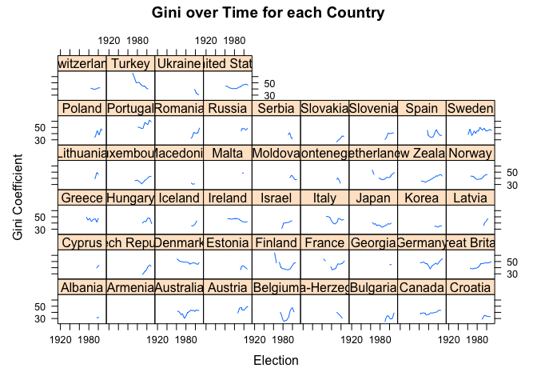
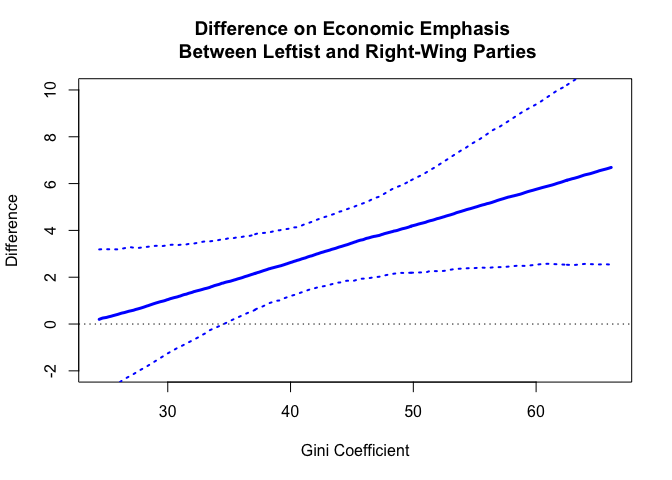

Lab 4: Visualization of Multilevel Linear Models
================
Constanza F. Schibber
February 18, 2021

- [1 Margit Tavits and Joshua Potter, 2015, “The Effect of Inequality
  and Social Identity on Party Strategies”.
  *AJPS*](#1-margit-tavits-and-joshua-potter-2015-the-effect-of-inequality-and-social-identity-on-party-strategies-ajps)
  - [1.1 Data and Descriptive
    Statistics](#11-data-and-descriptive-statistics)
  - [1.2 List of Countries](#12-list-of-countries)
  - [1.3 Outcome Variable](#13-outcome-variable)
  - [1.4 Key Explanatory Variable: Gini
    Coefficient](#14-key-explanatory-variable-gini-coefficient)
  - [1.5 Key Explanatory Variable: Right
    Party](#15-key-explanatory-variable-right-party)
  - [1.6 Control Explanatory Variable: Niche
    Party](#16-control-explanatory-variable-niche-party)
  - [1.7 Model](#17-model)
  - [1.8 Simulation](#18-simulation)
  - [1.9 Y-hat $\hat{Y}$](#19-y-hat-haty)
  - [1.10 Differences in $\hat{Y}$](#110-differences-in-haty)
  - [1.11 Marginal Effects](#111-marginal-effects)
- [2 Adding the Varying Slope due to the Cross-Level
  Interaction](#2-adding-the-varying-slope-due-to-the-cross-level-interaction)
  - [2.1 Multilevel Model with an Election
    Level](#21-multilevel-model-with-an-election-level)

# 1 Margit Tavits and Joshua Potter, 2015, “The Effect of Inequality and Social Identity on Party Strategies”. *AJPS*

This is a lab I developed to show bestter ways of visualizing
hierarchical modeling predictions and how to test hypotheses. To do
this, I picked one publication, worked through the theory, and their
replication material. I redid the visualization (this paper barely had
any visualization which is not uncommon, unfortunately). I also noticed
that the model is not specified correctly and we will discuss that
below.

To do the visualizations, I rely on Monte Carlo simulations.

You had to read the paper for class.

## 1.1 Data and Descriptive Statistics

The dataset has 3404 observations and 220 variables. After removing
cases according to the authors’ guidelines, we have 2646 observations
for 602 parties from 49 countries. However, there is missing data and
once that is considered, the model includes 1765 observations (unit of
analysis is election-party-country) for 441 parties in 41 countries.

## 1.2 List of Countries

The following is a list of countries included in the study (although
some are dropped from the model due to missingness). This is
problematic, because you claim you have a country in the data and then
it ends up being dropped from the empirical analysis:

``` r
unique(data$countryname)
```

    ##  [1] "Albania"            "Armenia"            "Australia"         
    ##  [4] "Austria"            "Belgium"            "Bosnia-Herzegovina"
    ##  [7] "Bulgaria"           "Canada"             "Croatia"           
    ## [10] "Cyprus"             "Czech Republic"     "Denmark"           
    ## [13] "Estonia"            "Finland"            "France"            
    ## [16] "Georgia"            "Germany"            "Great Britain"     
    ## [19] "Greece"             "Hungary"            "Iceland"           
    ## [22] "Ireland"            "Israel"             "Italy"             
    ## [25] "Japan"              "Korea"              "Latvia"            
    ## [28] "Lithuania"          "Luxembourg"         "Macedonia"         
    ## [31] "Malta"              "Moldova"            "Montenegro"        
    ## [34] "Netherlands"        "New Zealand"        "Norway"            
    ## [37] "Poland"             "Portugal"           "Romania"           
    ## [40] "Russia"             "Serbia"             "Slovakia"          
    ## [43] "Slovenia"           "Spain"              "Sweden"            
    ## [46] "Switzerland"        "Turkey"             "Ukraine"           
    ## [49] "United States"

## 1.3 Outcome Variable

We can create a histogram of the outcome variable and also a histogram
by country. We observe that there is heterogeneity in how much party
manifestos emphasize economic interests both within and across
countries.

``` r
# Histogram
hist(data$econ_sum, main = "Manifestos' Emphasis on Economic Interests",
    col = "blue", xlab = "")
```

<!-- -->

``` r
# Outcome variable by country #library(lattice)
histogram(~econ_sum | countryname, data, xlab = "Emphasis on Economic Interests")
```

<!-- -->

## 1.4 Key Explanatory Variable: Gini Coefficient

Gini coefficient is a continous measure. It is measured for each
election year. Here, I reduce the dataset so that it is a dataset by
election-country and then, I create a figure of the gini coefficient
over time for each country.

*Class question: Why do you think I did this?*

``` r
# Use only dataset for country-election
data.country.election <- data[!duplicated(subset(data, select = c(countryname,
    edate))), ]
dim(data.country.election)
```

    ## [1] 540 223

``` r
# Gini variable #library(lattice)
xyplot(gini_gross ~ edate | countryname, data = data.country.election,
    type = "l", main = "Gini over Time for each Country", xlab = "Election",
    ylab = "Gini Coefficient")
```

<!-- -->

## 1.5 Key Explanatory Variable: Right Party

The “right” variable indicates if a party is ideologically on the right
or not (for simplicity I named objects `right` or `left`, but parties
that are not on the right can also be centrists, so the `left` is both
leftist and centrist parties).

Here, I checked whether the variable the authors created varies over
time by party. I found a possible coding error. After fixing that, I
concluded that the variable `right` takes a single value for each party
in the study.

*Class question: Why do you think checking whether ideology varies over
time matters for modeling?*

I find it odd that their hypotheses are in terms of “leftists parties”,
but they decide to code `right` as `1` and `0`, othewise. If they had
done more figures in the results, this would not have been an issue.
That said, I prefer to have the theory and the empirics written on the
same direction (we’ve discussed this in class), otherwise readers will
get confused.

``` r
# % of right wing parties by election
right.percent <- aggregate(data$right4, by = list(data$party.id),
    FUN = mean)
summary(as.factor(right.percent[, "x"]))
```

    ##   0 0.9   1 
    ## 235   1 366

``` r
# which party has value 0.9 -- This was a coding error! The
# variable takes values 0 or 1, but one party had the value
# 0.9
which(right.percent[, "x"] == 0.9, arr.ind = TRUE)
```

    ## [1] 63

``` r
# LP Liberal Party, Canada
party.63 <- subset(data, party.id == 63)
party.63$right4
```

    ##  [1] 1 1 1 1 1 1 1 1 1 1 1 1 1 1 1 1 1 1 0 0

``` r
party.63$row.id
```

    ##  [1] 295 298 301 304 307 309 312 315 318 321 324 327 330 333 336 339 343 348 352
    ## [20] 355

``` r
# recode
data$right4[352] <- 1
data$right4[355] <- 1
```

## 1.6 Control Explanatory Variable: Niche Party

`niche` party also takes a single value for each party. I found another
coding error in measure for the same party (Liberal Party in Canada);
values are supposed to be either 0 or 1, but one party was labeled 0.1.

``` r
# % of right wing parties by election
niche.percent <- aggregate(data$niche, by = list(data$party.id),
    FUN = mean)
summary(as.factor(niche.percent[, "x"]))
```

    ##   0 0.1   1 
    ## 439   1 162

``` r
# which party has value 0.9
which(niche.percent[, "x"] == 0.1, arr.ind = TRUE)
```

    ## [1] 63

``` r
# LP Liberal Party, Canada recode # This was wrong, this
# party is not niche
party.63$niche
```

    ##  [1] 0 0 0 0 0 0 0 0 0 0 0 0 0 0 0 0 0 0 1 1

``` r
party.63$row.id
```

    ##  [1] 295 298 301 304 307 309 312 315 318 321 324 327 330 333 336 339 343 348 352
    ## [20] 355

``` r
data$niche[352] <- 0
data$niche[355] <- 0
```

## 1.7 Model

The authors propose a model in which the unit of analysis is at the
election- party- country. The way they wrote the model is not correct
(page 750), because they did not specify the level at which the
variables are included. They seem to think that every variable is
included at the lowest possible level.

A better way to write the model would be:

$$ emphasis_{epc} = \alpha_{party} + \beta_0 + \beta_{party} gini_{epc} +\mathbf{X}_{epc} + \epsilon_{epc}$$

$$ \alpha_{party} \sim N(\alpha_{country} + \gamma_1 right + \gamma_3 niche, \sigma^2_{party})$$

$$ \beta_{party} \sim N(\alpha_{country} + \gamma_1 right + \gamma_3 niche, \sigma^2_{party}) $$

$$ \alpha_{country} \sim N(0, \sigma^2_{country}) $$

Thus, we specify a hierarchical linear model in which observations are
nested in parties and countries. The lowest level of analysis is the
election-party-country level. To specify nested hierarchies we can use
either `(1| party.id) + (1| countryname)` or `(1|countryname/party.id)`.

Make sure your `IDs` have been created correctly! Potential problems
could be creating IDs such that the model fit is a non-nested model,
assigning the same ID to parties in different country because they share
a name, assigning different ID to the same party because the name was
written differently over time…

``` r
model.paper <- lmer(econ_sum ~ right4 # party level variable
            # election level
             + gini_gross 
            # cross-level interaction 
             + right4*gini_gross
            # individual level
             + newparty 
            # party level variable
             + niche 
            # individual level
             + pervote 
            # election level
             + gdpg 
             + enpv 
            # individual level
             + newdem
             + (1| party.id)
             + (1| countryname),
             data)
display(model.paper)
```

    ## lmer(formula = econ_sum ~ right4 + gini_gross + right4 * gini_gross + 
    ##     newparty + niche + pervote + gdpg + enpv + newdem + (1 | 
    ##     party.id) + (1 | countryname), data = data)
    ##                   coef.est coef.se
    ## (Intercept)       19.91     3.20  
    ## right4             3.55     3.67  
    ## gini_gross         0.17     0.07  
    ## newparty          -1.70     0.72  
    ## niche             -2.30     0.90  
    ## pervote            0.02     0.03  
    ## gdpg               0.13     0.07  
    ## enpv               0.45     0.19  
    ## newdem             0.30     0.94  
    ## right4:gini_gross -0.15     0.09  
    ## 
    ## Error terms:
    ##  Groups      Name        Std.Dev.
    ##  party.id    (Intercept) 4.60    
    ##  countryname (Intercept) 4.28    
    ##  Residual                8.68    
    ## ---
    ## number of obs: 1765, groups: party.id, 441; countryname, 41
    ## AIC = 13010.7, DIC = 12962.3
    ## deviance = 12973.5

``` r
# plot # lattice
dotplot(ranef(model.paper, condVar=TRUE), 
        ylab = "", 
        # make font smaller
        scales = list(y = list(cex= .5)))
```

    ## $party.id

<!-- -->

    ## 
    ## $countryname

<!-- -->

**This model has a HUGE problem: They are including a cross-level
interaction without specifying the varying slope.**

*Class Question: What assumption are they making by not specifying a
varying slope?*

I’ll keep working as if the analysis is correct and later, we will add
the varying slope.

## 1.8 Simulation

``` r
# create simulation of coefficients
n.draws <- 1000
sim.coef <- coef(sim(model.paper, n.draws))
# colnames(as.data.frame(sim.coef))
sim.coef <- as.data.frame(sim.coef)
# colnames(sim.coef) sim.coef[, 11:451] #party 452:788 #
# election
```

## 1.9 Y-hat $\hat{Y}$

Simulating predictions. Let’s write it out to understand how it is done.
We can later write functions to make the process easier.

``` r
## x intercept + right4 + gini_gross + right4:gini_gross

# create gini variable
seq.gini <- seq(from = min(na.omit(data$gini_gross)), to = max(na.omit(data$gini_gross)),
    by = 0.1)

# right wing
x.pred.right <- cbind(1, 1, seq.gini, seq.gini)
x.pred.right <- as.matrix(x.pred.right)
dim(x.pred.right)
```

    ## [1] 418   4

``` r
# left wing
x.pred.left <- cbind(1, 0, seq.gini, seq.gini * 0)
x.pred.left <- as.matrix(x.pred.left)
dim(x.pred.left)
```

    ## [1] 418   4

``` r
# beta
b.right <- sim.coef[, c("fixef..Intercept.", "fixef.right4",
    "fixef.gini_gross", "fixef.right4.gini_gross")]
dim(b.right)
```

    ## [1] 1000    4

``` r
# pred
y.pred.right <- x.pred.right %*% t(b.right)
y.pred.left <- x.pred.left %*% t(b.right)

# CI, median
ypred.ci.right <- apply(y.pred.right, 1, quantile, probs = c(0.025,
    0.5, 0.975))
ypred.ci.left <- apply(y.pred.left, 1, quantile, probs = c(0.025,
    0.5, 0.975))
```

Below is a plot. Before I had underlayed the histogram for the values of
the variable on the x-axis, but the package I used does not work
anymore.

``` r
# plot
par(mfrow = c(1, 2), mar = c(0.75, 0.75, 0.75, 0.75), oma = c(2,
    2, 1, 2), family = "serif")
plot(0, type = "n", xlim = range(seq.gini), ylim = c(15, 35),
    xlab = "Gini Coefficient", ylab = "Economic Emphasis of a Party Manifesto",
    main = "Righ-Wing Parties")
lines(seq.gini, ypred.ci.right[2, ], lwd = 3, col = "blue")
lines(seq.gini, ypred.ci.right[1, ], lty = 3, lwd = 2, col = "blue")
lines(seq.gini, ypred.ci.right[3, ], lty = 3, lwd = 2, col = "blue")
plot(0, type = "n", xlim = range(seq.gini), ylim = c(15, 35),
    xlab = "Gini Coefficient", ylab = "Economic Emphasis of a Party Manifesto",
    main = "Leftist Parties")
lines(seq.gini, ypred.ci.left[2, ], lwd = 3)
lines(seq.gini, ypred.ci.left[1, ], lty = 3, lwd = 2)
lines(seq.gini, ypred.ci.left[3, ], lty = 3, lwd = 2)
```

<!-- -->

## 1.10 Differences in $\hat{Y}$

We can calculate the difference on economic emphasis as inequality
(measured by gini) increases.

``` r
# y hat left - y hat right
diff.ypred <- y.pred.left - y.pred.right
ypred.diff.ci <- apply(diff.ypred, 1, quantile, probs = c(0.025,
    0.5, 0.975))

# plot par(mfrow = c(1,1), mar = c(.75,1.5,.75,.75), oma =
# c(2,2,1,2), family = 'serif')
plot(0, xlim = range(seq.gini), ylim = c(-2, 10), xlab = "Gini Coefficient",
    main = "Difference on Economic Emphasis \n Between Leftist and Right-Wing Parties",
    ylab = "Difference")
lines(seq.gini, ypred.diff.ci[2, ], lwd = 3, col = "blue")
lines(seq.gini, ypred.diff.ci[1, ], lty = 3, lwd = 2, col = "blue")
lines(seq.gini, ypred.diff.ci[3, ], lty = 3, lwd = 2, col = "blue")
abline(h = 0, lty = 3)
```

<!-- -->

We can also calculate the difference on economic emphasis for left-wing
parties in a relatively equal setting and for left-wing parties in a
relatively unequal setting. The same for right-wing parties.

``` r
# you have to select values of gini_gross
summary(data$gini_gross)
```

    ##    Min. 1st Qu.  Median    Mean 3rd Qu.    Max.    NA's 
    ##   24.42   37.60   41.68   41.74   46.68   66.13     583

``` r
## intercept + right4 + gini_gross + right4:gini_gross

# create gini variable
gini.quart <- rbind(summary(data$gini_gross)[5], summary(data$gini_gross)[2])
gini.quart <- as.matrix(gini.quart)

# right wing
x.pred.right.q <- cbind(1, 1, gini.quart, gini.quart)
x.pred.right.q <- as.matrix(x.pred.right.q)
dim(x.pred.right.q)
```

    ## [1] 2 4

``` r
# left wing
x.pred.left.q <- cbind(1, 0, gini.quart, gini.quart * 0)
x.pred.left.q <- as.matrix(x.pred.left.q)
dim(x.pred.left)
```

    ## [1] 418   4

``` r
# pred
y.pred.right.q <- x.pred.right.q %*% t(b.right)
y.pred.left.q <- x.pred.left.q %*% t(b.right)

# difference
diff.right.q <- y.pred.right.q[1, ] - y.pred.right.q[2, ]
diff.left.q <- y.pred.left.q[1, ] - y.pred.left.q[2, ]

# ci
diff.right.q <- quantile(diff.right.q, probs = c(0.025, 0.5,
    0.975))
diff.left.q <- quantile(diff.left.q, probs = c(0.025, 0.5, 0.975))

diff.right.q
```

    ##       2.5%        50%      97.5% 
    ## -1.0515234  0.1093221  1.2548631

``` r
diff.left.q
```

    ##      2.5%       50%     97.5% 
    ## 0.3820117 1.5446706 2.7421201

## 1.11 Marginal Effects

We can calculate the marginal effects. We take the derivative with
respect to the covariate `right`.

``` r
# x values
x.pred <- cbind(1, seq.gini)
x.pred <- as.matrix(x.pred)
dim(x.pred)
```

    ## [1] 418   2

``` r
# beta
b.pred <- cbind(sim.coef["fixef.right4"], sim.coef["fixef.right4.gini_gross"])
b.pred <- as.matrix(b.pred)
dim(b.pred)
```

    ## [1] 1000    2

``` r
# derivate w/ respect to x=right
ME <- x.pred %*% t(b.pred)
dim(ME)  # one column for each value of gini
```

    ## [1]  418 1000

``` r
# CI, median
me.ci <- apply(ME, 1, quantile, probs = c(0.025, 0.5, 0.975))
```

``` r
# plot par(mfrow = c(1,2), mar = c(.75,.75,.75,.75), oma =
# c(2,2,1,2), family = 'serif')
hist(na.omit(data$gini_gross), main = NA, axes = FALSE, col = "grey80",
    border = NA, ylab = "", xlab = "")
par(new = TRUE)
plot(0, type = "n", xlim = range(seq.gini), ylim = c(-10, 2),
    xlab = "Gini Coefficient", ylab = "Marginal Effect", main = "Economic Emphasis of a Party Manifesto")
lines(seq.gini, me.ci[2, ], lwd = 3)
lines(seq.gini, me.ci[1, ], lty = 3, lwd = 2)
lines(seq.gini, me.ci[3, ], lty = 3, lwd = 2)
abline(h = 0, lty = 3)
```

<!-- -->

We can look at the other marginal effect by taking the derivative with
respect to `gini`.

``` r
# derivate w/ respect to x=gini x values
x.pred.2 <- matrix(rep(1, 2), ncol = 2, nrow = 1)

# beta
b.pred.2 <- cbind(sim.coef["fixef.gini_gross"], sim.coef["fixef.right4.gini_gross"])
b.pred.2 <- as.matrix(b.pred.2)
dim(b.pred.2)
```

    ## [1] 1000    2

``` r
# me
ME.2 <- x.pred.2 %*% t(b.pred.2)
dim(ME.2)  # one column for each value of gini
```

    ## [1]    1 1000

``` r
# CI, median
me.ci.2 <- apply(ME.2, 1, quantile, probs = c(0.025, 0.5, 0.975))
me.ci.2
```

    ##              [,1]
    ## 2.5%  -0.11578996
    ## 50%    0.01203816
    ## 97.5%  0.13818098

Connie’s Rant: One conclusion we could make is that, in countries with
lower Gini, all parties seem to be emphasizing the economy more. If we
look at the varying intercepts by country, Scandinavian countries have
higher intercepts. As inequality increases, there is a wider gap in how
much left/right are emphasizing the economy (per ME plot).Further
considerations would be modeling inequality at the country level, like
including the mean Gini at the country level, and analyzing the results.

# 2 Adding the Varying Slope due to the Cross-Level Interaction

They include an interaction between `right4` which is at the party-level
and `gini_gross` which is at the party-election. This is a cross-level
interaction and, as a result, a random slope needs to be included. The
authors did not realize this!

Let’s fix it.

First, let’s fix the model and specify it correctly.

``` r
# The model has convergence problems so I center the measure  which solves the convergence issues

gini_gross_2 <-data$gini_gross-mean(na.omit(data$gini_gross))

# model vs for varying slope
model.vs <- lmer(econ_sum ~ right4 # party level variable
            # election level
             + gini_gross_2
            # cross-level interaction 
             + right4*gini_gross_2
            # individual level
             + newparty 
            # party level variable
             + niche 
            # individual level
             + pervote 
            # election-country level
             + gdpg 
             + enpv 
            # election-country level
             + newdem
             + (1 + gini_gross_2 | party.id)
             + (1| countryname),
             data)
```

    ## Warning in checkConv(attr(opt, "derivs"), opt$par, ctrl = control$checkConv, :
    ## Model failed to converge with max|grad| = 0.00336818 (tol = 0.002, component 1)

``` r
display(model.vs)
```

    ## lmer(formula = econ_sum ~ right4 + gini_gross_2 + right4 * gini_gross_2 + 
    ##     newparty + niche + pervote + gdpg + enpv + newdem + (1 + 
    ##     gini_gross_2 | party.id) + (1 | countryname), data = data)
    ##                     coef.est coef.se
    ## (Intercept)         26.82     1.56  
    ## right4              -2.94     0.76  
    ## gini_gross_2         0.18     0.08  
    ## newparty            -1.70     0.72  
    ## niche               -2.45     0.90  
    ## pervote              0.02     0.03  
    ## gdpg                 0.13     0.07  
    ## enpv                 0.47     0.19  
    ## newdem               0.49     0.95  
    ## right4:gini_gross_2 -0.13     0.10  
    ## 
    ## Error terms:
    ##  Groups      Name         Std.Dev. Corr  
    ##  party.id    (Intercept)  4.42           
    ##              gini_gross_2 0.34     -0.05 
    ##  countryname (Intercept)  4.33           
    ##  Residual                 8.54           
    ## ---
    ## number of obs: 1765, groups: party.id, 441; countryname, 41
    ## AIC = 13005.9, DIC = 12954.6
    ## deviance = 12965.2

Now, let’s do MC simulation for predictions.

``` r
# Simulation of coefficients
n.draws <- 1000
sim.coef <- coef(sim(model.vs, n.draws))
# colnames(as.data.frame(sim.coef))
sim.coef <- as.data.frame(sim.coef)
####################### Prediction
seq.gini.2 <- seq(from = min(na.omit(gini_gross_2)), to = max(na.omit(gini_gross_2)),
    by = 0.1)

x.pred.right.2 <- cbind(1, 1, seq.gini.2, seq.gini.2)
x.pred.right.2 <- as.matrix(x.pred.right.2)
dim(x.pred.right.2)
```

    ## [1] 418   4

``` r
# left wing
x.pred.left.2 <- cbind(1, 0, seq.gini.2, seq.gini.2 * 0)
x.pred.left.2 <- as.matrix(x.pred.left.2)
dim(x.pred.left.2)
```

    ## [1] 418   4

``` r
# beta
b.right.2 <- sim.coef[, c("fixef..Intercept.", "fixef.right4",
    "fixef.gini_gross_2", "fixef.right4.gini_gross_2")]
dim(b.right.2)
```

    ## [1] 1000    4

``` r
# pred
y.pred.right.2 <- x.pred.right.2 %*% t(b.right.2)
y.pred.left.2 <- x.pred.left.2 %*% t(b.right.2)

# CI, median
ypred.ci.right.2 <- apply(y.pred.right.2, 1, quantile, probs = c(0.025,
    0.5, 0.975))
ypred.ci.left.2 <- apply(y.pred.left.2, 1, quantile, probs = c(0.025,
    0.5, 0.975))
```

Finally, let’s make new plots for predictions.

``` r
# prediction plot
par(mfrow = c(1, 1), mar = c(0.75, 0.75, 0.75, 0.75), oma = c(2,
    2, 1, 2), family = "serif")
plot(0, type = "n", xlim = range(seq.gini.2), ylim = c(15, 35),
    xlab = "Gini Coefficient", ylab = "Economic Emphasis of a Party Manifesto")
lines(seq.gini.2, ypred.ci.right.2[2, ], lwd = 3, col = "blue")
lines(seq.gini.2, ypred.ci.right.2[1, ], lty = 3, lwd = 2, col = "blue")
lines(seq.gini.2, ypred.ci.right.2[3, ], lty = 3, lwd = 2, col = "blue")
lines(seq.gini.2, ypred.ci.left.2[2, ], lwd = 3)
lines(seq.gini.2, ypred.ci.left.2[1, ], lty = 3, lwd = 2)
lines(seq.gini.2, ypred.ci.left.2[3, ], lty = 3, lwd = 2)
```

<!-- -->

Let’s look at whether there is support for their hypotheses…

``` r
####################### Difference # y hat left - y hat
####################### right

diff.ypred.2 <- y.pred.left.2 - y.pred.right.2
ypred.diff.ci.2 <- apply(diff.ypred.2, 1, quantile, probs = c(0.025,
    0.5, 0.975))

# plot par(mfrow = c(1,1), mar = c(.75,.75,.75,.75), oma =
# c(2,2,1,2), family = 'serif')
plot(0, type = "n", xlim = range(seq.gini.2), ylim = c(-2, 10),
    xlab = "Gini Coefficient", ylab = "Effect of Difference on Economic Emphasis",
    main = "Difference Between Left Wing and Right Wing Parties (Left-Right) ")
lines(seq.gini.2, ypred.diff.ci.2[2, ], lwd = 3, col = "blue")
lines(seq.gini.2, ypred.diff.ci.2[1, ], lty = 3, lwd = 2, col = "blue")
lines(seq.gini.2, ypred.diff.ci.2[3, ], lty = 3, lwd = 2, col = "blue")
abline(h = 0, lty = 3)
```

<!-- -->

``` r
####################### Differences within right/left

## intercept + right4 + gini_gross + right4:gini_gross

# create gini variable
gini.quart.2 <- rbind(summary(gini_gross_2)[5], summary(gini_gross_2)[2])
gini.quart.2 <- as.matrix(gini.quart.2)

# right wing
x.pred.right.q.2 <- cbind(1, 1, gini.quart.2, gini.quart.2)
x.pred.right.q.2 <- as.matrix(x.pred.right.q.2)
dim(x.pred.right.q.2)
```

    ## [1] 2 4

``` r
# left wing
x.pred.left.q.2 <- cbind(1, 0, gini.quart.2, gini.quart.2 * 0)
x.pred.left.q.2 <- as.matrix(x.pred.left.q.2)
dim(x.pred.left.q.2)
```

    ## [1] 2 4

``` r
# pred
y.pred.right.q.2 <- x.pred.right.q.2 %*% t(b.right.2)
y.pred.left.q.2 <- x.pred.left.q.2 %*% t(b.right.2)

# difference
diff.right.q.2 <- y.pred.right.q.2[1, ] - y.pred.right.q.2[2,
    ]
diff.left.q.2 <- y.pred.left.q.2[1, ] - y.pred.left.q.2[2, ]

# ci
diff.right.q.2 <- quantile(diff.right.q.2, probs = c(0.025, 0.5,
    0.975))
diff.left.q.2 <- quantile(diff.left.q.2, probs = c(0.025, 0.5,
    0.975))

diff.right.q.2
```

    ##       2.5%        50%      97.5% 
    ## -0.9519856  0.4294176  1.7568098

``` r
diff.left.q.2
```

    ##      2.5%       50%     97.5% 
    ## 0.1101137 1.6025233 2.9886703

Because I centered the variable, it would be best to change the values
of x-axis to reflect the values of the variable without being centered.
I haven’t done that here to show that the variable is centered. It would
be easy to do. Simply, create the `plot` without the x-axis, add the
x-axis using `axis`, and specify the sequence you want to have at the
`ticks`.

*Class Question: How do results change by fitting the corrected model?*

## 2.1 Multilevel Model with an Election Level

*Class Question: Would an election level be necessary? How would you
write the equation for this model?*

First, we need to rearrange the data to create the IDs:

``` r
# election-country ID
data$election.ID <- apply(data[, c("countryname", "edate")],
    1, paste, collapse = "-")
head(data$election.ID)
```

    ## [1] "Albania-1991-03-31" "Albania-1991-03-31" "Albania-1991-03-31"
    ## [4] "Albania-1991-03-31" "Albania-1991-03-31" "Albania-1992-03-22"

``` r
election.id <- NA
uniq.election.country <- unique(data$election.ID)
E <- length(uniq.election.country)
for (i in 1:E) {
    for (j in 1:nrow(data)) {
        ifelse(data$election.ID[j] == uniq.election.country[i],
            election.id[j] <- i, NA)
    }
}

data$election.id <- election.id
summary(election.id)
```

    ##    Min. 1st Qu.  Median    Mean 3rd Qu.    Max. 
    ##     1.0   142.0   277.0   273.0   405.8   540.0

Then we fit the model:

``` r
model.el.0 <- lmer(econ_sum ~ right4  # party level variable - does not change?
 +
    gini_gross_2  #election-country Level
 + right4 * gini_gross_2 +
    newparty + niche  # party level variable
 + pervote +
    gdpg  #election-country Level
 + enpv  #election-country Level
 +
    newdem  #election-country Level?
 + (1 + gini_gross_2 |
    party.id) + (1 + right4 | election.id) + (1 | countryname),
    data)
```

    ## Warning in checkConv(attr(opt, "derivs"), opt$par, ctrl = control$checkConv, :
    ## Model failed to converge with max|grad| = 0.00509245 (tol = 0.002, component 1)

``` r
# Model does not converge so I run it for longer
start.model.el <- getME(model.el.0, c("theta", "fixef"))
model.el <- update(model.el.0, start = start.model.el, control = lmerControl(optCtrl = list(maxfun = 20000)))

display(model.el)
```

    ## lmer(formula = econ_sum ~ right4 + gini_gross_2 + right4 * gini_gross_2 + 
    ##     newparty + niche + pervote + gdpg + enpv + newdem + (1 + 
    ##     gini_gross_2 | party.id) + (1 + right4 | election.id) + (1 | 
    ##     countryname), data = data, control = lmerControl(optCtrl = list(maxfun = 20000)), 
    ##     start = start.model.el)
    ##                     coef.est coef.se
    ## (Intercept)         26.97     1.79  
    ## right4              -3.04     0.75  
    ## gini_gross_2         0.13     0.09  
    ## newparty            -1.84     0.71  
    ## niche               -2.62     0.87  
    ## pervote              0.01     0.02  
    ## gdpg                 0.17     0.09  
    ## enpv                 0.51     0.27  
    ## newdem               0.33     1.15  
    ## right4:gini_gross_2 -0.12     0.10  
    ## 
    ## Error terms:
    ##  Groups      Name         Std.Dev. Corr  
    ##  party.id    (Intercept)  4.50           
    ##              gini_gross_2 0.31     -0.12 
    ##  election.id (Intercept)  3.79           
    ##              right4       2.53     -0.09 
    ##  countryname (Intercept)  4.10           
    ##  Residual                 7.59           
    ## ---
    ## number of obs: 1765, groups: party.id, 441; election.id, 337; countryname, 41
    ## AIC = 12921.1, DIC = 12867.5
    ## deviance = 12876.3

*Class Question: Compare this model to the other models.*

``` r
library(stargazer)
```

    ## 
    ## Please cite as:

    ##  Hlavac, Marek (2022). stargazer: Well-Formatted Regression and Summary Statistics Tables.

    ##  R package version 5.2.3. https://CRAN.R-project.org/package=stargazer

``` r
stargazer(model.vs, model.el, header = FALSE, type = "html")
```

<table style="text-align:center">
<tr>
<td colspan="3" style="border-bottom: 1px solid black">
</td>
</tr>
<tr>
<td style="text-align:left">
</td>
<td colspan="2">

<em>Dependent variable:</em>

</td>
</tr>
<tr>
<td>
</td>
<td colspan="2" style="border-bottom: 1px solid black">
</td>
</tr>
<tr>
<td style="text-align:left">
</td>
<td colspan="2">

econ_sum

</td>
</tr>
<tr>
<td style="text-align:left">
</td>
<td>

$1$

</td>
<td>

$2$

</td>
</tr>
<tr>
<td colspan="3" style="border-bottom: 1px solid black">
</td>
</tr>
<tr>
<td style="text-align:left">

right4

</td>
<td>

-2.939<sup>\*\*\*</sup>

</td>
<td>

-3.037<sup>\*\*\*</sup>

</td>
</tr>
<tr>
<td style="text-align:left">
</td>
<td>

(0.761)

</td>
<td>

(0.753)

</td>
</tr>
<tr>
<td style="text-align:left">
</td>
<td>
</td>
<td>
</td>
</tr>
<tr>
<td style="text-align:left">

gini_gross_2

</td>
<td>

0.176<sup>\*\*</sup>

</td>
<td>

0.133

</td>
</tr>
<tr>
<td style="text-align:left">
</td>
<td>

(0.078)

</td>
<td>

(0.086)

</td>
</tr>
<tr>
<td style="text-align:left">
</td>
<td>
</td>
<td>
</td>
</tr>
<tr>
<td style="text-align:left">

newparty

</td>
<td>

-1.698<sup>\*\*</sup>

</td>
<td>

-1.836<sup>\*\*\*</sup>

</td>
</tr>
<tr>
<td style="text-align:left">
</td>
<td>

(0.723)

</td>
<td>

(0.711)

</td>
</tr>
<tr>
<td style="text-align:left">
</td>
<td>
</td>
<td>
</td>
</tr>
<tr>
<td style="text-align:left">

niche

</td>
<td>

-2.451<sup>\*\*\*</sup>

</td>
<td>

-2.619<sup>\*\*\*</sup>

</td>
</tr>
<tr>
<td style="text-align:left">
</td>
<td>

(0.903)

</td>
<td>

(0.871)

</td>
</tr>
<tr>
<td style="text-align:left">
</td>
<td>
</td>
<td>
</td>
</tr>
<tr>
<td style="text-align:left">

pervote

</td>
<td>

0.023

</td>
<td>

0.015

</td>
</tr>
<tr>
<td style="text-align:left">
</td>
<td>

(0.026)

</td>
<td>

(0.025)

</td>
</tr>
<tr>
<td style="text-align:left">
</td>
<td>
</td>
<td>
</td>
</tr>
<tr>
<td style="text-align:left">

gdpg

</td>
<td>

0.132<sup>\*</sup>

</td>
<td>

0.165<sup>\*</sup>

</td>
</tr>
<tr>
<td style="text-align:left">
</td>
<td>

(0.070)

</td>
<td>

(0.092)

</td>
</tr>
<tr>
<td style="text-align:left">
</td>
<td>
</td>
<td>
</td>
</tr>
<tr>
<td style="text-align:left">

enpv

</td>
<td>

0.465<sup>\*\*</sup>

</td>
<td>

0.507<sup>\*</sup>

</td>
</tr>
<tr>
<td style="text-align:left">
</td>
<td>

(0.193)

</td>
<td>

(0.267)

</td>
</tr>
<tr>
<td style="text-align:left">
</td>
<td>
</td>
<td>
</td>
</tr>
<tr>
<td style="text-align:left">

newdem

</td>
<td>

0.493

</td>
<td>

0.327

</td>
</tr>
<tr>
<td style="text-align:left">
</td>
<td>

(0.953)

</td>
<td>

(1.147)

</td>
</tr>
<tr>
<td style="text-align:left">
</td>
<td>
</td>
<td>
</td>
</tr>
<tr>
<td style="text-align:left">

right4:gini_gross_2

</td>
<td>

-0.129

</td>
<td>

-0.116

</td>
</tr>
<tr>
<td style="text-align:left">
</td>
<td>

(0.099)

</td>
<td>

(0.096)

</td>
</tr>
<tr>
<td style="text-align:left">
</td>
<td>
</td>
<td>
</td>
</tr>
<tr>
<td style="text-align:left">

Constant

</td>
<td>

26.824<sup>\*\*\*</sup>

</td>
<td>

26.970<sup>\*\*\*</sup>

</td>
</tr>
<tr>
<td style="text-align:left">
</td>
<td>

(1.563)

</td>
<td>

(1.792)

</td>
</tr>
<tr>
<td style="text-align:left">
</td>
<td>
</td>
<td>
</td>
</tr>
<tr>
<td colspan="3" style="border-bottom: 1px solid black">
</td>
</tr>
<tr>
<td style="text-align:left">

Observations

</td>
<td>

1,765

</td>
<td>

1,765

</td>
</tr>
<tr>
<td style="text-align:left">

Log Likelihood

</td>
<td>

-6,487.942

</td>
<td>

-6,442.566

</td>
</tr>
<tr>
<td style="text-align:left">

Akaike Inf. Crit.

</td>
<td>

13,005.880

</td>
<td>

12,921.130

</td>
</tr>
<tr>
<td style="text-align:left">

Bayesian Inf. Crit.

</td>
<td>

13,088.020

</td>
<td>

13,019.700

</td>
</tr>
<tr>
<td colspan="3" style="border-bottom: 1px solid black">
</td>
</tr>
<tr>
<td style="text-align:left">

<em>Note:</em>

</td>
<td colspan="2" style="text-align:right">

<sup>*</sup>p\<0.1; <sup>**</sup>p\<0.05; <sup>***</sup>p\<0.01

</td>
</tr>
</table>

``` r
# create simulation of coefficients
n.draws <- 1000
sim.coef.el <- coef(sim(model.el, n.draws))
sim.coef.el <- as.data.frame(sim.coef.el)
# colnames(sim.coef)
```

``` r
# x values
seq.gini <- seq(from = min(na.omit(gini_gross_2)), to = max(na.omit(gini_gross_2)),
    by = 0.1)
x.pred <- cbind(1, seq.gini)
x.pred <- as.matrix(x.pred)
dim(x.pred)
```

    ## [1] 418   2

``` r
# derivate w/ respect to right beta
b.pred <- cbind(sim.coef.el["fixef.right4"], sim.coef.el["fixef.right4.gini_gross_2"])
b.pred <- as.matrix(b.pred)
dim(b.pred)
```

    ## [1] 1000    2

``` r
# ME
ME <- x.pred %*% t(b.pred)
dim(ME)  # one column for each value of gini
```

    ## [1]  418 1000

``` r
# CI, median
me.ci <- apply(ME, 1, quantile, probs = c(0.025, 0.5, 0.975))

# plot par(mfrow = c(1,1), mar = c(.75,1.5,.75,.75), oma =
# c(2,2,1,2), family = 'serif')
plot(0, type = "n", xlim = range(seq.gini), ylim = c(-10, 2),
    xlab = "Gini Coefficient", main = "Marginal Effect of Being a Right-Wing Party \n on Economic Emphasis of its Manifesto",
    ylab = "Marginal Effect")
lines(seq.gini, me.ci[2, ], lwd = 3, col = "forestgreen")
lines(seq.gini, me.ci[1, ], lty = 5, col = "darkgreen")
lines(seq.gini, me.ci[3, ], lty = 5, col = "darkgreen")
abline(h = 0, lty = 3)
```

<!-- -->

``` r
# derivate w/ respect to x=gini x values
x.pred.2 <- matrix(rep(1, 2), ncol = 2, nrow = 1)

# beta
b.pred.2 <- cbind(sim.coef.el["fixef.gini_gross_2"], sim.coef.el["fixef.right4.gini_gross_2"])
b.pred.2 <- as.matrix(b.pred.2)
dim(b.pred.2)
```

    ## [1] 1000    2

``` r
# me
ME.2 <- x.pred.2 %*% t(b.pred.2)
dim(ME.2)  # one column for each value of gini
```

    ## [1]    1 1000

``` r
# CI, median
me.ci.2 <- apply(ME.2, 1, quantile, probs = c(0.025, 0.5, 0.975))
me.ci.2
```

    ##              [,1]
    ## 2.5%  -0.15251932
    ## 50%    0.02175438
    ## 97.5%  0.18144839
